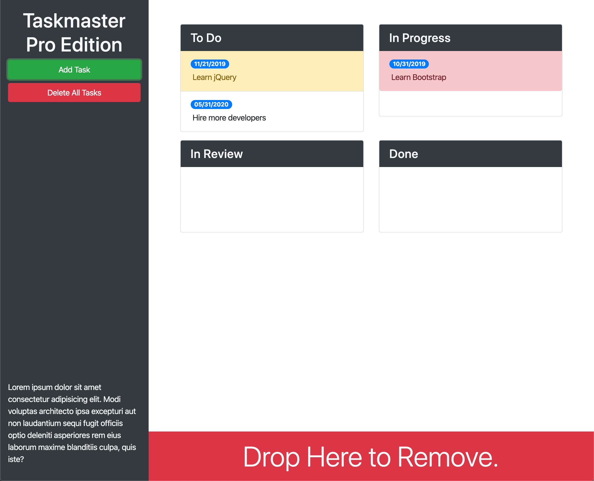

# Taskmaster Pro

The main purpose of this project is to create a "task management app" using jQuery, Bootstrap and Moment.js. This application enables users to add tasks into four groups ("To Do", "In Progress", "In Review" and "Done") and assign due dates to them. The tasks will be conditionally highlighted if they are near/overdue.

## Task List

- [x] Make user interface style clean and polished.
- [x] Dynamically change HTML and CSS using JavaScript.
- [x] Enable users to create tasks with descriptions and due dates.
- [x] Make task data persistent, by using localStorage.
- [x] Traverse and manipulate the DOM using jQuery methods.
- [x] Attach delegated browser events to elements with jQuery methods.
- [x] Implement a better user experience with focus and blur events.

## Tech/framework used
* HTML
* CSS
* JavaScript
* jQuery
* Bootstrap
* Moment.js
* jQuery UI
* jQuery UT Touch Punch

## User Story

As a user, I would like to track my tasks with their due dates using a task management app, so that I do not miss any deadlines and better prioritize my work.

## Acceptance Criteria

* When I click on a task's description, it will turn it into an editable field.
* When I click on a task's due date, it will turn it into an editable field.
* When I click off of either task's description or due date, it will turn it back into its original form.
* I should be able to drag tasks within and between columns.
* I should be able to drag a task to trash to delete it.
* I should be able to set due dates using a calendar datepicker.
* The tasks that are near/overdue should be highlighted.

## Link to Deployed Application

https://sshahram.github.io/taskmaster-pro/

## Link to Github Repository

https://github.com/sshahram/taskmaster-pro

## Screenshot

Here is the snapshot of the website:

